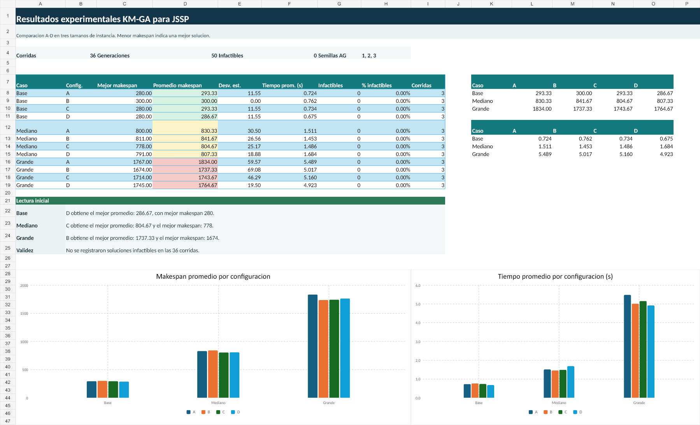

# KM-GA para JSSP

Proyecto académico que integra **K-Means** con un **Algoritmo Genético (AG)**
para el problema **Job Shop Scheduling Problem (JSSP)**. K-Means se utiliza
únicamente para construir parte de la población inicial; la evaluación por
`makespan` y los operadores principales del AG se mantienen.

## Diseño experimental

- `K = 3` clusters con `sklearn.cluster.KMeans`.
- Inicialización `k-means++`, `n_init = 10`.
- Población de `20` individuos y `50` generaciones.
- Semillas del AG: `1`, `2` y `3`.
- Casos: Base (`8 x 14`), Mediano (`15 x 14`) y Grande (`30 x 20`).
- Configuraciones A-D: desde población completamente aleatoria hasta mezclas
  de perfiles, reglas de prioridad y diversidad aleatoria.

## Resultado principal

Se ejecutaron `36` corridas. Una menor medida de makespan indica una mejor
solución.

| Caso | Mejor configuración por promedio | Promedio makespan | Mejor makespan |
| --- | --- | ---: | ---: |
| Base | D | 286.67 | 280 |
| Mediano | C | 804.67 | 778 |
| Grande | B | 1737.33 | 1674 |

No se registraron soluciones infactibles en las corridas evaluadas.



## Estructura

```text
ADA_Kmeans/
|-- codigo/
|   |-- generador_instancias_jssp.py
|   `-- km_ga_jssp_experimento.py
|-- instancias/
|   `-- CSV de los casos y manifiesto de semillas
|-- resultados/
|   |-- CSV de corridas, convergencia y resumen
|   |-- Resultados_experimentales_KM_GA_JSSP.xlsx
|   `-- graficas/
|-- informe/
|   |-- Informe_final_KM_GA_JSSP.docx
|   `-- Informe_final_KM_GA_JSSP.pdf
|-- requirements.txt
`-- LICENSE
```

## Ejecución

Requisitos: Python 3.10 o posterior.

```powershell
python -m venv .venv
.\.venv\Scripts\Activate.ps1
python -m pip install -r requirements.txt
python .\codigo\km_ga_jssp_experimento.py
```

El programa genera nuevas salidas reproducibles junto al script, dentro de
`codigo\instancias_jssp` y `codigo\resultados_km_ga_jssp_tres_casos`.
Los resultados consolidados utilizados en el informe ya se incluyen en
`resultados/`.

## Reutilización funcional

La solución conserva y reutiliza del código Python de referencia las funciones
de cálculo de `makespan` y cruza PMX. Las nuevas funciones incorporan el
generador de instancias, los perfiles de K-Means, la población inicial
configurable y la exportación de resultados.

## Documentación

El informe completo, con metodología, tablas, gráficas de convergencia,
discusión, bitácora de uso de IA y conclusiones, está disponible en
[`informe/Informe_final_KM_GA_JSSP.pdf`](informe/Informe_final_KM_GA_JSSP.pdf).

## Nota de entrega

Antes de la entrega académica deben completarse los datos personales de la
portada del informe y adjuntarse las capturas fechadas solicitadas por el
profesor.

